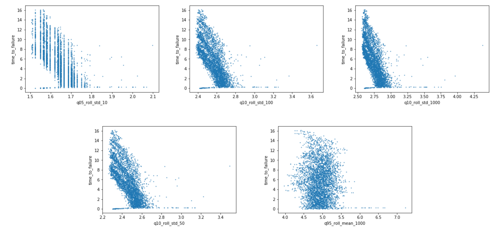
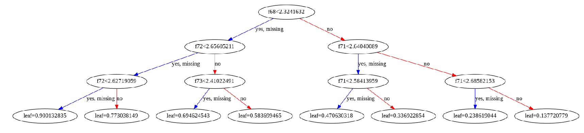
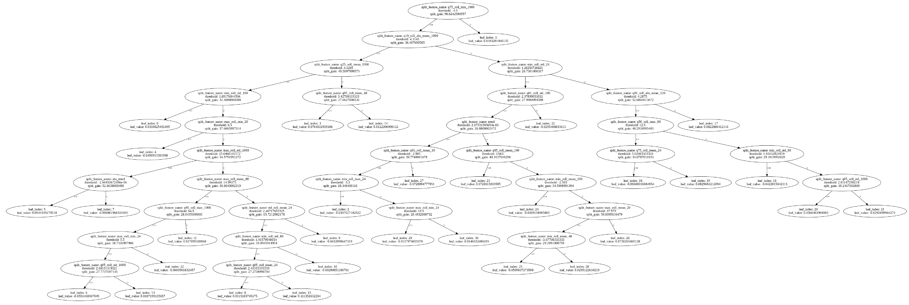
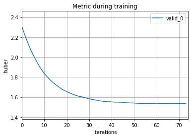
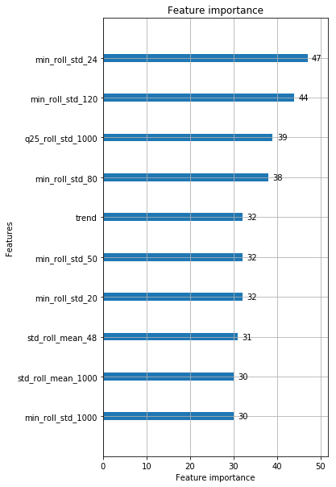
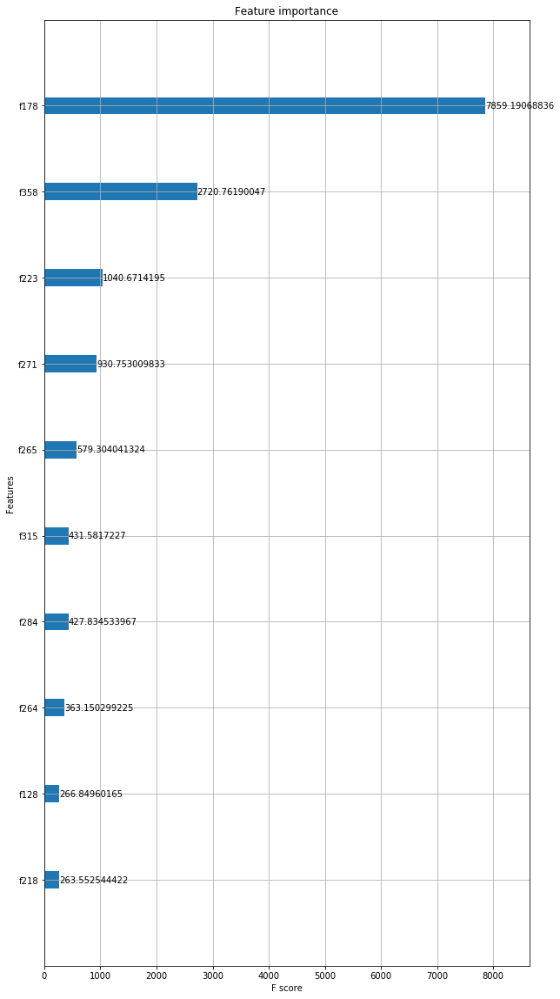

# LANL-Earthquake-Prediction
## 1. Introduction
This project is a solution to Kaggle Competitive Challenge: [LANL Earthquake Prediction](https://www.kaggle.com/c/LANL-Earthquake-Prediction)

* Private: LB Score: 982, Score: 2.55368
* Public: LB Score: 2752, Score: 1.54446

Problem Statement: Given a dataset of acoustic signal predict the timing of earthquake.

The acoustic signal data is a laboratory generated data with approximately 629,400,000 rows and two columns:
* acoustic_data
* time_to_failure

Test data is of the size 2624 sets of 150,000 acoustic_data entries. Hence our training data is divided in sets of 150,000 

Our goal is to fit a model that takes as input 150,000 entries of acoustic_data and output a single time_to_failure value.
Hence our problem is one of regression problem. It is understood that input data of 150,000 instances of a single feature
alone will be of little significance, as we will not be able to extract useful information/pattern from this raw data.

This project will consist of following subproblems:
* Feature Engineering
* Network Modelling

## 2. Feature Engineering
Our first goal is to find features that can be used to fit model. Since 'acoustic_data' is raw data, we use it extract features such as
* Minimum
* Maximum
* Standard Deviation
* Quartile
* Trends
* Rolling Features

Estimated Features: 

For more details: [Baseline Model](https://www.kaggle.com/jsaguiar/baseline-with-multiple-models)

We experiment with datasets of two sizes: 124 features and 550 features. Hence our datasets will be of size (4195, 124) or (4195, 550).

## 3. Network Modelling
We propose two types of models:
* Neural Network (Fully Connected Dense Nets)

* Gradient Boost Methods
  * XGBOOST
  
  
  * LightGBM
  
  

LightGBM gives the best performance. However, our main goal is to use deep learning techniques for this problem.

Kaggle scores for the models were as follows:
* Neural Network with 5 Dense Layers - 2.98
* Neural Network with 2 Dense Layers - 2.97
* XGBOOST - 2.58
* LightGBM - 2.55

We see that Dense Net with 5 hidden layers overfits. Hence we reduce the network to 2 hidden layers.

Following is the training score plotted against EPOCHs

Most important features: 
* LightGBM

* XGBOOST

